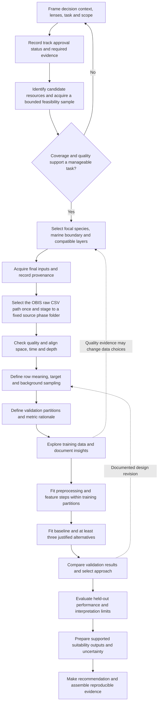

# ML workflow and evidence gates

This is a shared analytical workflow, with primary ownership and shared participation defined by the [member responsibility plan](../project/member-responsibilities.md). It is not a fixed modelling recipe. The current phase is recorded in the [status review](../project/repository-readiness-and-alignment.md). Technical stages remain pending until requested.

## Workflow

The accepted path convention is in [D-038](../records/2026-10-08-decision-phase-specific-derived-data-paths.md).
The OBIS handoff accepts a selected raw CSV path once and writes to its stable
phase folder. Each later transformation gets its own source subfolder; its
script reads the preceding phase's fixed path and writes a fixed, timestamp-free
destination. Bio-ORACLE's corresponding folder layout is documented only; this
branch adds no Bio-ORACLE code. See [data storage and provenance](../data/data-storage-and-provenance.md)
for the current and planned path patterns.

Limited feasibility investigation may inform framing and the approval request. It does not establish approval or stakeholder engagement. Prior approval must be evidenced before claiming an approved Industry Explorer project.

Non-outcome quality checks can cover the acquired data. Exploratory work that influences feature choice or model design must respect validation boundaries. After a design revision, maintain a genuinely held-out evaluation; do not repeatedly inspect test results to tune the pipeline.

## Evidence gates

| Gate | Evidence needed | Record or form | Current state |
| --- | --- | --- | --- |
| Framing and track | Verifiable context/decision, lenses and rationale, scope, success criteria, approval evidence | [Framing](../templates/problem-framing-canvas.md); [decisions](../project/decision-register.md) | Shared proposal direction present; decision context and approval pending |
| Data feasibility and path handoff | Exact resources, permissions/terms, counts/coverage, candidate species/area, spatial-temporal-depth compatibility, reproducible source paths | [Manifest](../templates/data-source-record.md); [dictionary](../templates/data-dictionary.md); [D-038 path decision](../records/2026-10-08-decision-phase-specific-derived-data-paths.md) | OBIS acquisition and byte-preserving source-validation handoff are implemented; no scientific cleaning has been applied. Bio-ORACLE acquisition and compatibility remain pending; its path layout is documentation only |
| Target and validation | Row meaning, positive/background definitions, sampling/bias rationale, splits, leakage controls, metrics | [Evaluation design](../templates/validation-and-evaluation-plan.md); [decisions](../project/decision-register.md) | Pending |
| Preparation and methods | Observed EDA, justified feature steps, baseline plus at least three alternatives, consistent comparison protocol | [EDA](../templates/eda-insight-log.md); [features](../templates/preprocessing-and-feature-decisions.md); [comparison](../templates/model-comparison.md) | Pending |
| Recommendation and handover | Evidence-linked value, uncertainty/domain limits, reproducible code/notebook, consistent report outputs and deliverables | [Recommendation](../templates/recommendations-and-limitations.md); [assessment checklist](../../PROJECT_REQUIREMENTS.md) | Pending |

Use evidence to revisit a gate when appropriate. Gate completion is a documented judgement, not a box inferred from a directory or blank form.

## Data and model artefact formats

Retain raw inputs as supplied. Use GeoParquet for compatible derived spatial records and Parquet for compatible non-spatial ML tables; keep complete environmental arrays in their source formats and place extracted location-level predictors in the integrated table. Record actual source and derived formats, specification versions, and any justified departures in the source records and dataset manifest. Keep each interim phase in its own stable, timestamp-free source subfolder as set out in [D-038](../records/2026-10-08-decision-phase-specific-derived-data-paths.md). The first OBIS handoff accepts a selected raw CSV path; later stages use fixed upstream and destination paths. Bio-ORACLE's layout is documented only in this branch. The workflow does not select a modelling library or fix model serialization; record the chosen format and environment for each actual model artefact. COG and ONNX are optional, unfinalised future BLUEVERSE integration suggestions only.

## Ownership and handovers

| Stage | Working primary ownership | Required collaboration |
| --- | --- | --- |
| Framing, feasibility selection and final technical choices | All four shared | Species, domain, features, target, methods, validation and final selection remain group decisions |
| Biological data, occurrence quality and target/background inputs | Sanuda | Ushan/Adithya support; Wanshaja review |
| Environmental preparation and spatial integration | Ushan | Sanuda/Adithya support; Wanshaja review |
| Integrated quality, EDA and preprocessing | Adithya | All four participate; source-specific cleaning stays with Sanuda/Ushan |
| Feature engineering | Ushan and Adithya | Sanuda/Wanshaja participate |
| Baseline | Sanuda primary/shared | All four participate under the agreed protocol |
| Candidate training | Adithya and Wanshaja | Sanuda/Ushan participate; record particular candidate implementation ownership when methods are agreed |
| Validation and evaluation | Wanshaja | All four participate; agree partitions before design-informing EDA and learned transformations |
| Interpretation and habitat-suitability output | Wanshaja primary/shared | All four review final selection, output meaning and limitations |
| Final evidence, report, demo and reproducible handover | All four shared | Each supplies their actual technical evidence; each prepares their own individual learning report |

Follow the [handover duties](../project/member-contributions/shared-responsibilities-and-evidence.md#handover-and-final-submission-duties). Source data and integration must retain identifiers/versions for target, partition and feature lineage. Propagate a data/preprocessing change to the baseline and every comparison run. Review each gate using evidence rather than assuming a primary member's planned task is finished.

## Execution planning

Python 3.14 is the project baseline under [D-039](../records/2026-10-08-decision-python-3-14-baseline.md), and the current Python intake and repository tooling use the `OCEAVERA` Conda environment documented in the [root README](../../README.md#create-the-conda-environment). The ML framework, exact scientific dependency versions and experiment configuration remain undecided; confirm selected libraries support the baseline before implementation. The root [`requirements.txt`](../../requirements.txt) is the canonical inventory for third-party Python packages; it currently contains no package requirements because the active intake scripts use the standard library. When implementation adds or changes a package, update the manifest with its selected exact version and revise the setup instructions in the same change.

The [complete responsibility matrix](../project/member-responsibilities.md#complete-pipeline-responsibility-matrix) establishes the finalised working member roles, subject to recorded changes. No calendar deadline is established here. Agree milestones against confirmed course dates and the approved scope; the Industry Explorer bonus requires manageable scope within seven weeks.

## Later BLUEVERSE handover

If the evaluated output is suitable for later integration, document its schema, geographic/environmental domain, target meaning, uncertainty, data-use conditions, and generation method. A reviewed analytical artefact is the proposed handover; operational deployment remains outside the current assignment scope.

The integration discussion proposes PostgreSQL/PostGIS for operational spatial records and JSON/GeoJSON at API boundaries, with large analytical assets stored separately and referenced from the application database. Confirm the receiving BLUEVERSE interface and approvals before implementation. COG and ONNX remain optional, unfinalised future BLUEVERSE integration suggestions; they are not required OCEAVERA outputs.

Complete [model metadata](../templates/model-metadata.json) only for an actual trained artefact. Tie any acceptance claim to the dataset, reproducible environment, comparison protocol, evaluation evidence and limitations. A notebook or anonymous model file alone does not establish an accepted integration output.
