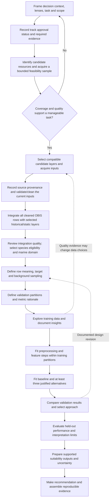

# ML workflow and evidence gates

This is a shared analytical workflow, with primary ownership and shared participation defined by the [member responsibility plan](../project/member-responsibilities.md). It is not a fixed modelling recipe. The current phase is recorded in the [status review](../project/repository-readiness-and-alignment.md). OBIS cleaning, Bio-ORACLE structural/numerical scanning, D-054 Policy B water-centre candidates and D-056 full-population long-format presence/background candidates are documented. Group approval of the modelling population, domain, sampling and target remains open, as do EDA and later analytical stages.

## Current feature and target status

The 382 Bio-ORACLE columns are integrated feature definitions, not 382 mandatory model predictors. The 112 preserved OBIS columns are occurrence/source metadata and are not automatically predictors. Script 09 creates spatial candidates. Script 10 preserves all 2,353 Policy B observations as label-1 rows and adds 2,353 separate label-0 sampled-background rows. Label 0 is not a confirmed absence. The generated candidate does not approve a final supervised target or predictor set.

The current D-056 long-format output is data/interim/pseudo_absence/presence_background_candidates.parquet. It preserves all 519 source fields in their original order and appends eight fields to create 4,706 rows × 527 columns. Seed 20261016 samples unique GSHHG-water centres without replacement across observations and periods; every occupied Policy B cell is excluded. Six core values are required for sampled background rows, and all 382 environmental features are regular columns with missing values and quarantines null. The 2020–2026 period uses the SSP245 2020 environmental slice. This candidate is for review and descriptive EDA, not an approved target. Group review must address target meaning, accessible area, repeated occurrences, environmental gaps, effort bias, temporal comparability and spatially blocked validation. Model scores should be interpreted as relative habitat-suitability scores unless independent evidence supports probability calibration.

## Workflow

```mermaid
flowchart TD
    A[Frame decision context, lenses, task and scope] --> B[Record track approval status and required evidence]
    B --> C[Identify candidate resources and acquire a bounded feasibility sample]
    C --> D{Coverage and quality support a manageable task?}
    D -- No --> A
    D -- Yes --> E[Select compatible candidate layers and acquire inputs]
    E --> F[Record source provenance and validate/clean the current inputs]
    F --> G[Integrate all cleaned OBIS rows with selected historical/static layers]
    G --> H[Review integration quality; select species eligibility and marine domain]
    H --> I[Define row meaning, target and background sampling]
    I --> J[Define validation partitions and metric rationale]
    J --> K[Explore training data and document insights]
    K --> L[Fit preprocessing and feature steps within training partitions]
    L --> M[Fit baseline and at least three justified alternatives]
    M --> N[Compare validation results and select approach]
    N --> O[Evaluate held-out performance and interpretation limits]
    O --> P[Prepare supported suitability outputs and uncertainty]
    P --> Q[Make recommendation and assemble reproducible evidence]
    K -. Quality evidence may change data choices .-> E
    N -. Documented design revision .-> I
```

The interim retention policy is [D-049](../records/2026-10-11-decision-interim-one-current-dataset.md);
D-038 remains the historical source-intake path decision. Each data family
has only one current stage directory. OBIS currently uses
`data/interim/obis/cleaning/` for the source-validation manifest, cleaned CSV
and JSON reports; validation does not create a sibling folder. Bio-ORACLE now
uses `data/interim/bio_oracle/cleaning/`, with a manifest and structural/
numerical summary that reference unchanged raw NetCDF products. The prior
source-validation bundle was rechecked in full before cleaning replaced it;
that state can be regenerated from the raw run and staging script. Other
dataset states can be regenerated from preserved raw sources and scripts.
The Bio-ORACLE source-validation state is one logical bundle of NetCDF layers
and receipts, replaced as a whole after successful validation. Under
[D-047](../records/2026-10-09-decision-bio-oracle-catalog-intake.md)
and [D-048](../records/2026-10-09-decision-bio-oracle-sri-lanka-bbox.md),
the Bio-ORACLE collector inventories all regional v3 grids and supports
all-variable NetCDF retrieval over explicit bounds and the requested 2000–2100
window. The current ERDDAP axes expose baseline coordinates at 2000/2010 and
SSP coordinates at 2020–2090, with no separate 2100 coordinate in these layers.
Bio-ORACLE documents decadal, not annual, data: the 2090 SSP label reaches the
end of the final decade at 2100. Its catalogue-level baseline includes a
2010–2020 decade, but exact coverage through 2020 for each downloaded baseline
layer remains unresolved because titles vary and the time-axis metadata only
labels 2000/2010. D-048's named preset selects the rectangle made from the Marine Regions
EEZ polygon's coordinate extrema; it does not apply the EEZ polygon or a marine
mask. Catalogue and payload retrieval outcomes are recorded in the dated
intake record. The current cleaning record documents 356 readable products
and 2,392 variable instances, with one product flagged for a single missing
value. It reports a candidate spatial domain without assigning land/water
meaning to undocumented `landmass` values. It does not create corrected
rasters, integrate sources or make the data modelling-ready.
The initial D-046 test payload
was deleted at the user's request. D-050 records the all-row integration
implementation, full in-memory audit and published GeoParquet. It extracts six selected surface
baseline/static products for 23,371 cleaned OBIS rows, while retaining each row
and its source quality fields. The selected dynamic coordinates are the stored
2000 and 2010 labels, which are decadal labels rather than annual observations.
The audit found 16,840 rows with all 11 requested values available and 6,531
rows mapping to cells where all selected fields are fill values; no rows were
outside the raster extent, partly missing or extraction errors. These states
remain explicit in the output design. The empirical non-fill footprint is not
an authoritative ocean mask. The final table has 23,371 rows and 133 columns;
the writer and independent saved-file checks preserve all source attributes,
identifiers, coordinates, cell assignments, environmental nulls and values.
See the [D-050 decision](../records/2026-10-12-decision-obis-bio-oracle-integration.md),
[integration summary](../records/2026-10-12-integration-summary.json),
[manifest](../records/2026-10-12-integration-manifest.json) and
[branch notebook](../../notebooks/branch_work/05_pipeline_data_integration_and_data_cleaning.ipynb).
The empirical non-fill footprint remains only a data-availability indicator.
See [data storage and provenance](../data/data-storage-and-provenance.md)
for the current dataset path and format.

Limited feasibility investigation may inform framing and the approval request. It does not establish approval or stakeholder engagement. Prior approval must be evidenced before claiming an approved Industry Explorer project.

Non-outcome quality checks can cover the acquired data. Exploratory work that influences feature choice or model design must respect validation boundaries. After a design revision, maintain a genuinely held-out evaluation; do not repeatedly inspect test results to tune the pipeline.

## Evidence gates

| Gate | Evidence needed | Record or form | Current state |
| --- | --- | --- | --- |
| Framing and track | Verifiable context/decision, lenses and rationale, scope, success criteria, approval evidence | [Framing](../templates/problem-framing-canvas.md); [decisions](../project/decision-register.md) | Shared proposal direction present; decision context and approval pending |
| Data feasibility and path handoff | Exact resources, permissions/terms, counts/coverage, candidate species/area, spatial-temporal-depth compatibility, reproducible source paths | [Manifest](../templates/data-source-record.md); [dictionary](../templates/data-dictionary.md); [D-049 interim retention policy](../records/2026-10-11-decision-interim-one-current-dataset.md); [current OBIS cleaning record](../records/2026-10-11-obis-area-230-cleaning.md); [historical column-screen record](../records/2026-10-10-obis-area-230-column-screening.md); [OBIS EDA record](../records/2026-10-10-obis-area-230-eda.md); [D-047 catalogue-intake decision](../records/2026-10-09-decision-bio-oracle-catalog-intake.md); [D-048 collection rectangle](../records/2026-10-09-decision-bio-oracle-sri-lanka-bbox.md); [Bio-ORACLE cleaning record](../records/2026-10-11-bio-oracle-cleaning.md); [D-050 integration decision](../records/2026-10-12-decision-obis-bio-oracle-integration.md); [prepublication audit](../records/2026-10-12-obis-bio-oracle-prepublication-audit.md) | OBIS acquisition, validation and conservative row cleaning are implemented; its current CSV has 23,371 rows and 112 columns. Bio-ORACLE acquisition and cleaning cover 356 products and 2,392 variable instances; 355 products are validated/reused and one needs review for one fill value. The D-050 all-row in-memory integration audit passed for six compatible baseline/static products; final GeoParquet publication/read-back awaits writer setup authorisation. Focal-species eligibility and final modelling domain remain open. |
| Target and validation | Row meaning, positive/background definitions, sampling/bias rationale, splits, leakage controls, metrics | [Full-population evaluation plan](../records/2026-10-16-full-population-presence-background-evaluation-plan.md); [D-056](../records/2026-10-16-decision-paired-presence-background.md); [decisions](../project/decision-register.md) | Long-format candidate implemented and technically verified; group target/domain approval and split/metric protocol pending |
| Preparation and methods | Observed EDA, justified feature steps, baseline plus at least three alternatives, consistent comparison protocol | [EDA](../templates/eda-insight-log.md); [features](../templates/preprocessing-and-feature-decisions.md); [comparison](../templates/model-comparison.md) | Pending |
| Recommendation and handover | Evidence-linked value, uncertainty/domain limits, reproducible code/notebook, consistent report outputs and deliverables | [Recommendation](../templates/recommendations-and-limitations.md); [assessment checklist](../../PROJECT_REQUIREMENTS.md) | Pending |

Use evidence to revisit a gate when appropriate. Gate completion is a documented judgement, not a box inferred from a directory or blank form.

## Data and model artefact formats

Retain raw inputs as supplied. Use GeoParquet for compatible derived spatial records and Parquet for compatible non-spatial ML tables; keep environmental grid responses in NetCDF and place extracted location-level predictors in the integrated table. Record actual source and derived formats, specification versions, and any justified departures in the source records and dataset manifest. Under D-049, keep one current dataset per family. Where stage directories are used, retain exactly one active stage directory directly beneath the family path and replace it only after the full new result passes validation; a single-table family may use its fixed destination. OBIS currently has only `data/interim/obis/cleaning/`; Bio-ORACLE has only `data/interim/bio_oracle/cleaning/`, whose manifest maps 356 byte-verified interim NetCDF products directly to their raw sources and whose summary records the full scan. D-050 is historical. D-051 records full and temporal GeoParquet outputs; D-053 documents the former strict marine filter; D-054 defines current Policy B marine and grid outputs; D-056 defines the current long-format presence/background candidate. Policy B requires valid flags and a strict GSHHG water-centre match, and records uncertainty without excluding on that basis. D-056 samples actual marine-water grid centres, excludes every Policy B occupied cell globally and writes one label-0 background row per unchanged label-1 observation. The D-055 aggregated experiment remains historical and its dataset/reports are hash-preserved. Any later preprocessing must preserve row lineage and treat the sampled-background label as distinct from confirmed absence. Earlier integration states remain reproducible from raw inputs and scripts. The first OBIS handoff accepts a selected raw CSV path and writes `source_validation_manifest.json` inside the `cleaning/` directory. The D-047 Bio-ORACLE collector inventories regional v3 products and requests all data variables with per-layer query manifests; D-048 sets the collection rectangle from the Marine Regions EEZ extent. The current catalogue selected 356 grids and 2,392 variables; actual time coverage and acquisition status are recorded in the [dated intake record](../records/2026-10-09-source-bio-oracle-sri-lanka-catalog.md). The Bio-ORACLE handoff, [`06_stage_bio_oracle_layers.py`](../../src/data_preparation/06_stage_bio_oracle_layers.py), accepts a selected complete run manifest and copies its NetCDF payloads and receipts unchanged after structural and integrity checks; it can regenerate the earlier source-validation stage by replacing the current stage. Its `--dry-run` option checks run and receipt metadata, file sizes and available space without writing files; if a prior interim stage exists, it also verifies that stage payload hashes before replacement. The [cleaning script](../../src/data_preparation/07_clean_bio_oracle_layers.py) fully scans NetCDF structure and arrays, and publishes byte-for-byte NetCDF copies in the interim stage; it modifies no values unless a verified correction is justified. One marine-domain fill value remains under review. The rectangle does not apply a polygon mask. NumPy, pandas, netCDF4, GeoPandas and PyArrow are pinned for the D-051 integration; package/environment operations await explicit authorisation under D-043. The workflow does not select an ML library or fix model serialization; record the chosen format and environment for each actual model artefact. COG and ONNX are optional, unfinalised future BLUEVERSE integration suggestions only.

## Ownership and handovers

| Stage | Working primary ownership | Required collaboration |
| --- | --- | --- |
| Framing, feasibility selection and final technical choices | All four shared | Species, domain, features, target, methods, validation and final selection remain group decisions |
| Biological data, occurrence quality and target/background inputs | Sanuda | Ushan/Adithya support; Wanshaja review |
| Environmental preparation and spatial integration | Ushan | Sanuda/Adithya support; Wanshaja review |
| Integrated quality, EDA and preprocessing | Adithya | All four participate; source-specific cleaning stays with Sanuda/Ushan |
| Feature engineering | Ushan and Adithya | Sanuda/Wanshaja participate |
| Baseline | Sanuda primary/shared | All four participate under the agreed protocol |
| Candidate training | Adithya and Wanshaja | Sanuda/Ushan participate; record particular candidate implementation ownership when methods are agreed |
| Validation and evaluation | Wanshaja | All four participate; agree partitions before design-informing EDA and learned transformations |
| Interpretation and habitat-suitability output | Wanshaja primary/shared | All four review final selection, output meaning and limitations |
| Final evidence, report, demo and reproducible handover | All four shared | Each supplies their actual technical evidence; each prepares their own individual learning report |

Follow the [handover duties](../project/member-contributions/shared-responsibilities-and-evidence.md#handover-and-final-submission-duties). Source data and integration must retain identifiers/versions for target, partition and feature lineage. Propagate a data/preprocessing change to the baseline and every comparison run. Review each gate using evidence rather than assuming a primary member's planned task is finished.

## Execution planning

Python 3.14 is the project baseline under [D-039](../records/2026-10-08-decision-python-3-14-baseline.md), and the `OCEAVERA` Conda setup is documented in the [root README](../../README.md#create-the-conda-environment). This repository does not store a Python environment. Jupyter Notebook and `ipykernel` are pinned in the root [`requirements.txt`](../../requirements.txt) for notebooks. GeoPandas 1.2.0 and PyArrow 26.0.0 are pinned for GeoParquet integration writing and validation; these do not select the ML framework or its scientific stack. ML dependencies and experiment configuration remain undecided; confirm selected libraries support the baseline before implementation. When a package is added or changed, update the manifest with its selected exact version and revise the setup instructions in the same change. An agent must obtain explicit prior user authorisation before creating, modifying or removing an environment or installing, upgrading or removing packages; documenting setup commands or updating the manifest is not permission to perform those operations.

The [complete responsibility matrix](../project/member-responsibilities.md#complete-pipeline-responsibility-matrix) establishes the finalised working member roles, subject to recorded changes. No calendar deadline is established here. Agree milestones against confirmed course dates and the approved scope; the Industry Explorer bonus requires manageable scope within seven weeks.

## Later BLUEVERSE handover

If the evaluated output is suitable for later integration, document its schema, geographic/environmental domain, target meaning, uncertainty, data-use conditions, and generation method. A reviewed analytical artefact is the proposed handover; operational deployment remains outside the current assignment scope.

The integration discussion proposes PostgreSQL/PostGIS for operational spatial records and JSON/GeoJSON at API boundaries, with large analytical assets stored separately and referenced from the application database. Confirm the receiving BLUEVERSE interface and approvals before implementation. COG and ONNX remain optional, unfinalised future BLUEVERSE integration suggestions; they are not required OCEAVERA outputs.

Complete [model metadata](../templates/model-metadata.json) only for an actual trained artefact. Tie any acceptance claim to the dataset, reproducible environment, comparison protocol, evaluation evidence and limitations. A notebook or anonymous model file alone does not establish an accepted integration output.
